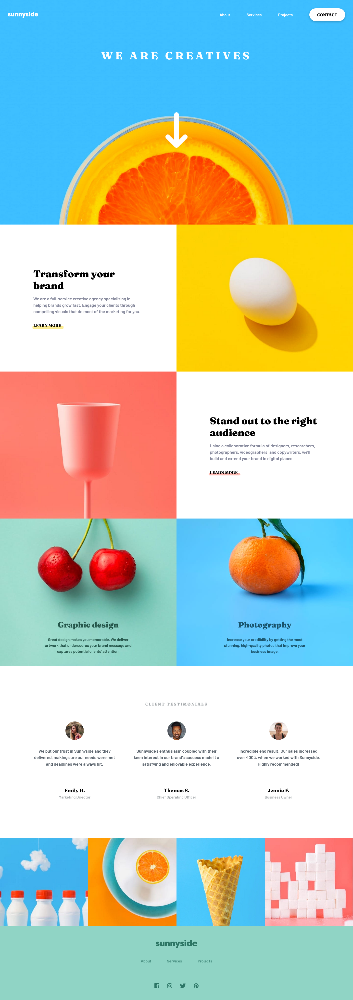

# Frontend Mentor - Sunnyside agency landing page solution

This is a solution to the [Sunnyside agency landing page challenge on Frontend Mentor](https://www.frontendmentor.io/challenges/sunnyside-agency-landing-page-7yVs3B6ef). Frontend Mentor challenges help you improve your coding skills by building realistic projects.

## Overview

### The challenge

Users should be able to:

- View the optimal layout for the site depending on their device's screen size
- See hover states for all interactive elements on the page

### Screenshot

### Links

- Live Site URL: [Link](https://emiacerbi.github.io/sunnyside-agency/)

## My process

### Built with

- Semantic HTML5 markup
- CSS custom properties
- Flexbox
- CSS Grid
- Mobile-first workflow
- [Sass](sass-lang.com) 
- [Font Awesome](https://fontawesome.com/) 

## Author

`Emi Acerbi`

## Acknowledgments

As always, thanks to [Frontend Mentor](https://www.frontendmentor.io/) for the awesome challenge to practice with!
